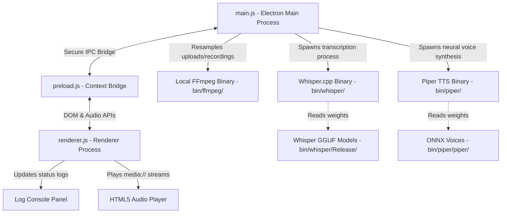
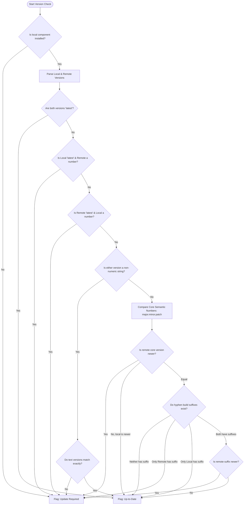

# Local Speech & Synthesis Studio (SpeechBoleh)

SpeechBoleh is a state-of-the-art, fully offline Desktop Client for high-fidelity **Speech-to-Text (STT)** transcription and **Text-to-Speech (TTS)** neural synthesis. The application is completely self-contained, guaranteeing 100% data privacy as zero sound waves, recordings, or synthesized transcripts ever leave your local computer.

---

## 🚀 Key Features

* **Local Speech-to-Text (STT)**: Powered by a high-performance standalone [Whisper.cpp](https://github.com/ggerganov/whisper.cpp) wrapper, transcribing microphone recordings or uploaded audio files (.mp3, .wav, .m4a).
* **Local Text-to-Speech (TTS)**: Powered by the offline [Piper](https://github.com/rhasspy/piper) Neural TTS engine, generating voice files from input text using highly natural local ONNX voice models.
* **Granular Voice Control**: Sliders to adjust speaking pace, gaps between sentences, tone variance, and phoneme cadence.
* **Diagnostics & Device Overrides**: Built-in visualizers, playback tools for recorded microphone clips, and hardware input overrides to select specific microphone tracks.
* **Activity Log Console**: A real-time, color-coded terminal-style console printing all background activity, transcoding steps, model downloads, and pipeline events.
* **Fully Self-Contained**: Configured to run using local [FFmpeg](https://ffmpeg.org/) and model assets stored directly in the application folder (`bin/`).

---

## 🚩 Release Note

Current release includes both the Portable version and the Installer version packaged together in a single ZIP file. If you prefer not to install the application on your system, you can simply run SpeechBoleh 0.6.0.exe directly. At this moment, this release exclusively supports Windows 64-bit operating systems.

### Prerequisite Note:
When you launch the application for the first time, it will check for the Microsoft Visual C++ Redistributable. If it is missing from your system, the application will prompt you to automatically download and install it. Once the C++ Runtime installation finishes, the application will be ready to use.

If you prefer not to use the automatic installer, you can manually download and install the runtime directly from the official [Microsoft website](https://aka.ms/vs/17/release/vc_redist.x64.exe).

I have included [Whisper.cpp](https://github.com/ggerganov/whisper.cpp) and [Piper](https://github.com/rhasspy/piper) directly in the package to handle local CPU model inference. Looking ahead, future updates will introduce features allowing you to seamlessly download new models and upgrade existing ones directly within the application.

---

## 👉 Run Directly from Source

To run the application directly from the source code, you need to have Node.js installed on your system. The application uses Electron.js to wrap the web interface and Node.js to power backend services.

### Prerequisites:
Before you begin, ensure you have the following installed:

1. **Node.js**: v20.x LTS or [higher](https://nodejs.org/en/download/current) (You can skip Step 4 below by installing the native build tools during this step.)
2. **npm**: v10.x or higher (Optional)
3. **Git**: For version control (Optional)
4. **Visual Studio Build Tools** (for Windows development):
   - Install the "Desktop development with C++" workload
   - Include the "MSVC v143 - VS 2022 C++ x64/x86 build tools" optional component

### Installation:

1. **Clone the repository**:
   This is not required if you download zip file from [release](https://github.com/tinwinaung/SpeechBoleh/releases) or [repo](https://github.com/tinwinaung/SpeechBoleh/archive/refs/heads/main.zip).

   ```bash
   git clone <repository-url>
   cd SpeechBoleh
   ```

2. **Install dependencies**:
   This is required before you run `npm start` or `npm run dist`.

   ```bash
   npm install
   ```

### Development:

1. **Start the application**:  

   ```bash
   npm start
   ```

### Distribution (Create Installer and Portable App)

First, you need to install the dependencies (as shown above).
Then, you can run the following command to create a release build:

```bash
npm run dist
```

---

## 🛠️ Technology Stack

### 1. Frontend & Core Layout
* **HTML5 & Vanilla JavaScript**: Controls DOM interactions, events, and audio context playback.
* **Bootstrap 5**: Provides a responsive grid system and styled controls.
* **Custom CSS (index.css)**: Implements a premium dark mode UI using glassmorphism, glowing accents, and animated custom range sliders.
* **Bootstrap Icons**: Used for system, sound, and control icons.

### 2. Runtime & Native Shell
* **Electron.js**: Wraps the web interface into a cross-platform desktop application shell.
* **Node.js**: Powers backend services, handles file streams, and spawns native binary wrappers.
* **IPC (Inter-Process Communication) Bridge**: Programmed with strict Electron security practices (`contextIsolation: true`, `nodeIntegration: false`) using a secure `preload.js` script.
* **Custom Protocol Server**: Registers a secure local `media://` protocol to stream temporary `.wav` files safely between Node.js temporary folders and HTML5 audio player elements without exposing standard file path URIs.

### 3. Speech-to-Text Pipeline (STT)
* **Whisper.cpp**: Standalone high-performance C++ transcription binary running GGUF-compatible weights (Project: [ggerganov/whisper.cpp](https://github.com/ggerganov/whisper.cpp), Binaries: [Releases](https://github.com/ggerganov/whisper.cpp/releases)).
* **Local [FFmpeg](https://ffmpeg.org/)**: Embedded inside `bin/ffmpeg/bin/ffmpeg.exe`, handling input resampling and converting diverse uploads into standard 16-bit mono PCM wav files required by Whisper.cpp. Windows builds are sourced from [gyan.dev](https://www.gyan.dev/ffmpeg/builds/).
* **Gyan.dev Model Downloader**: A redirect-aware HTTPS downloader that fetches model weights (`ggml-tiny.bin` and `ggml-base.bin`) directly from Hugging Face repositories, handling 307/308 relative location redirections dynamically.

### 4. Text-to-Speech Pipeline (TTS)
* **Piper TTS**: Standalone C++ executable release running local voice models (Project: [rhasspy/piper](https://github.com/rhasspy/piper), Binaries: [Releases](https://github.com/rhasspy/piper/releases)).
* **ONNX Runtime (Embedded)**: Loaded via Piper to process ONNX-based voice models (`en_US-lessac-medium.onnx`, `en_US-joe-medium.onnx`, `en_US-ryan-medium.onnx`).
* **Hugging Face Downloader**: Downloads voice models (`.onnx` and `.json` configs) dynamically to your offline cache directory.


## 📁 Project Architecture & Components



### Component Details:
* **`main.js`**: Spawns binaries via child processes (`spawn`, `execFile`), cleans up temporary files (`tmp/`) on start and exit, registers secure protocols, and resolves relative URL redirection headers during model downloads.
* **`preload.js`**: Safely exposes native APIs to the renderer including `sttTranscribe`, `ttsSynthesize`, `downloadVoiceModel`, `getVoices`, and progress event hooks.
* **`renderer.js`**: Handles device selection (`navigator.mediaDevices`), starts/stops `MediaRecorder` buffers, monitors audio timelines, updates progress bars, and manages console log lines.
* **`index.html`**: Contains the visual workspace grid, tabs for recording vs. uploading files, and collapsible panels for advanced synthesis configurations.
* **`index.css`**: Styling rules, glowing buttons, visualizer waves, animations, and typography.

---

## 🔄 Version Comparison Flow for OTA

SpeechBoleh utilizes a hybrid OTA version-check comparison engine. Below is the decision tree used to evaluate if a component requires an update:



---

## 📥 Component Installation & Initialization Flow

SpeechBoleh automatically checks platform requirements and missing engine binaries at startup. Below is the bootstrap and installation flow:

```mermaid
flowchart TD
    Start([App Startup]) --> PlatformCheck{Is OS Windows?}
    PlatformCheck -->|Yes| MSVCCheck{Is MSVC++ 2015-2022 Runtime installed?}
    PlatformCheck -->|No| DepCheck[Scan core binaries: FFmpeg, Piper, Whisper]
    
    MSVCCheck -->|No| PromptMSVC[Prompt User & Launch MSVC Installer]
    MSVCCheck -->|Yes| DepCheck
    PromptMSVC --> DepCheck
    
    DepCheck --> CheckDeps{Are all core binaries present?}
    CheckDeps -->|Yes| PopulateLists[Scan & load local mics, voices, and Whisper models]
    CheckDeps -->|No| ShowOverlay[Display Fullscreen Download Overlay]
    
    ShowOverlay --> CheckLocalVersion{Is local version NULL/undefined?}
    CheckLocalVersion -->|Yes| UseLocalUrl[Bypass online query. Use local package.json URLs]
    CheckLocalVersion -->|No| ResolveUrls[Query Online raw package.json for download URLs]
    
    UseLocalUrl --> DownFFmpeg{Is FFmpeg missing?}
    ResolveUrls --> DownFFmpeg
    DownFFmpeg -->|Yes| InstallFFmpeg[Download, extract, and copy ffmpeg.exe]
    DownFFmpeg -->|No| DownPiper{Is Piper missing?}
    
    InstallFFmpeg --> DownPiper
    DownPiper -->|Yes| InstallPiper[Download, extract, and copy piper.exe]
    DownPiper -->|No| DownWhisper{Is Whisper missing?}
    
    InstallPiper --> DownWhisper
    DownWhisper -->|Yes| InstallWhisper[Download, extract, and copy whisper-cli.exe]
    DownWhisper -->|No| DownModels{Are default models/voices missing?}
    
    InstallWhisper --> DownModels
    DownModels -->|Yes| InstallModels[Download default ggml-base.bin and default voice model]
    DownModels -->|No| SaveMetadata[Update local package.json with downloaded versions/URLs]
    
    InstallModels --> SaveMetadata
    SaveMetadata --> HideOverlay[Hide Fullscreen Download Overlay]
    HideOverlay --> PopulateLists
    
    PopulateLists --> Ready([SpeechBoleh Ready & Dashboard Active])
```



---

## 🎛️ Detailed Synthesis Parameter Tuning

Piper TTS allows for deep modulation of offline speech outputs. SpeechBoleh exposes these directly to the user:

| Parameter | Piper Argument | Range | Default | Purpose |
| :--- | :--- | :--- | :--- | :--- |
| **Speech Speed** | `--length_scale` | `0.5x` to `2.0x` | `1.0x` | Mapped as `length_scale = 1.0 / speed`. Controls speaking rate. |
| **Sentence Silence** | `--sentence_silence` | `0.0s` to `3.0s` | `0.2s` | Controls duration of pauses between sentences. Useful for reading long text files. |
| **Noise Scale** | `--noise_scale` | `0.00` to `1.50` | `0.67` | Dictates noise variance in tone textures. Higher values create organic voice shifts. |
| **Phoneme Noise W** | `--noise_w` | `0.00` to `1.50` | `0.80` | Modulates individual word and syllable cadence variance. |

---

## 📦 Packaging & Exclusions

When preparing a production package (e.g. using `electron-builder`), ensure development files are omitted to keep the installer lightweight.

### Recommended Files Configuration:
```json
"build": {
  "files": [
    "**/*",
    "!scratch/**",
    "!bin/*.zip",
    "bin/ffmpeg/bin/ffmpeg.exe",
    "bin/piper/piper/**/*",
    "bin/whisper/Release/whisper-cli.exe"
  ]
}
```


